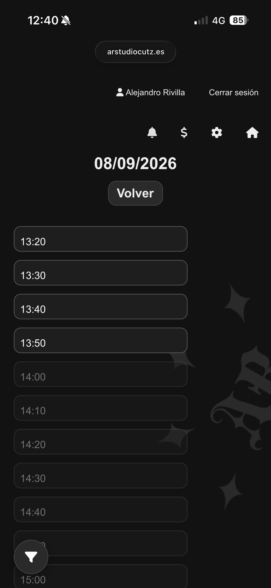

<p align="center">
  
</p>

```
https://www.arstudiocutz.es
```

## ARSTUDIO 🇬🇧

ARSTUDIO is a complete web platform developed for a real barbershop.

- `/main` — public website used as the business showcase, focused on branding, services and customer attraction.
- `/home` — web application with a system for managing appointments, clients, and business operations.

## ARSTUDIO 🇪🇸

ARSTUDIO es una plataforma web desarrollada para una barbería real.

* `/main` — carta de presentación pública enfocado en la identidad del negocio, servicios y captación de clientes.
* `/home` — aplicación web con un sistema de gestión de citas, clientes y administración del negocio.

### 🌐 ARSTUDIO 🇬🇧

#### /main

- Business presentation
- Work gallery
- Location map
- Service and price display

<p align="center">
  
</p>

### 🌐 ARSTUDIO 🇪🇸

#### /main

* Presentación del negocio
* Galería de trabajos realizados
* Ubicación
* Visualización de servicios y precios

<p align="center">
  
</p>

### ✂️ ARSTUDIO 🇬🇧
#### /home

The application has been designed to simplify appointment calendar management, improve the internal organization of the business, and provide customers with a more convenient system for requesting and managing their appointments.

Part of the platform's development was carried out as preparation prior to the opening of the establishment, conducting tests during the initial phase and later integrating it into the business's regular operations.

<p align="center">
  
</p>

### ✂️ ARSTUDIO 🇪🇸
#### /home

La aplicación ha sido diseñada para facilitar la administración del calendario de reservas, mejorar la organización interna del negocio y ofrecer a los clientes un sistema más cómodo para solicitar y gestionar sus citas.

Parte del desarrollo de la plataforma se realizó como preparación previa a la apertura del establecimiento, llevando a cabo pruebas durante la fase inicial e integrándose posteriormente en el funcionamiento habitual del negocio.

<p align="center">
  
</p>

#### Features 🇬🇧

##### 📌 User management
- **Controlled access** — verification system to prevent unwanted user registrations and allow their rejection.
- **User customization** — interface to manage user data and credentials (name, password...).

##### 📌 Appointment system
- **Appointment management system** — complete system for creating, editing and managing customer appointments.

#### 📌 Appointment booking system (customer)

- **Availability control** — prevents the creation of appointments that overlap with time slots already occupied.
- **Service duration control** — calculates the total appointment duration based on the selected service.
- **Available time slot selection** — displays only available time slots according to existing appointments.
- **Duplicate submission prevention** — prevents multiple simultaneous submissions through session control.
- **Access control** — restricts appointment creation according to the user type (customer, barber or administrator).

##### 📌 Business management
- **Customer management** — storage and organization of customer information for appointment tracking.
- **Services management** — management of available services, allowing users to view, create and edit them.
- **Schedule management** — management of work schedules, including the ability to block out time (absences, holidays...)
- **Accounting panel** — summary dashboard providing an overview of gross revenue, pending/cancelled appointments, and payment history (customer, payment method, revenue per appointment and date).

##### 📌 Technical features
- **Database integration** — persistent storage of appointments and application data.
- **Responsive design** — interface adaptation for desktop, tablet and mobile devices.
- **Notifications** — displays new users pending validation/rejection and shows appointments pending cancellation.

#### Funcionalidades 🇪🇸

##### 📌 Gestión de usuarios

* **Acceso controlado** — sistema de verificación para evitar registros de usuarios no deseados.
* **Personalización del usuario** — interfaz para la gestión de datos y credenciales del usuario (nombre, contraseña...)

##### 📌 Sistema de citas

* **Sistema de gestión de citas** — sistema completo para crear, editar y gestionar las citas de los clientes.

##### 📌 Sistema de reserva de citas (cliente) 

- **Control de disponibilidad** — evita la creación de citas que coincidan con horarios ya ocupados.
- **Control de duración del servicio** — calcula la duración total de la cita según el servicio seleccionado.
- **Selección de horarios disponibles** — muestra únicamente bloques horarios libres según las citas existentes.
- **Prevención de duplicidad durante el proceso** — evita múltiples envíos simultáneos mediante control de sesión.
- **Control de acceso** — limita la creación de citas según el tipo de usuario (cliente, barbero o administrador).

##### 📌 Gestión del negocio

* **Gestión de clientes** — administración de la información de los clientes para el seguimiento de sus citas.
* **Gestión de servicios** — administración de los servicios disponibles.
* **Gestión de horarios** — administración del horario de trabajo, incluyendo la posibilidad de bloqueos de tiempo (ausencias, vacaciones...)
* **Panel de contabilidad** — resumen que permite consultar la facturación en bruto, citas pendientes/canceladas y el historial de pagos (cliente, método de pago, ingresos por cita y fecha)

##### 📌 Características técnicas

* **Integración con base de datos** — almacenamiento persistente de las citas y de los datos de la aplicación.
* **Diseño responsive** — adaptación de la interfaz para dispositivos de escritorio, tablets y móviles.
* **Notificaciones** — muestra nuevos usuarios pendientes de validación/rechazo y citas pendientes de cancelación.

## Last Release

🔗 v.1.2.2 (no download available)<br/><br/>
🚀 ARSTUDIO PROJECT